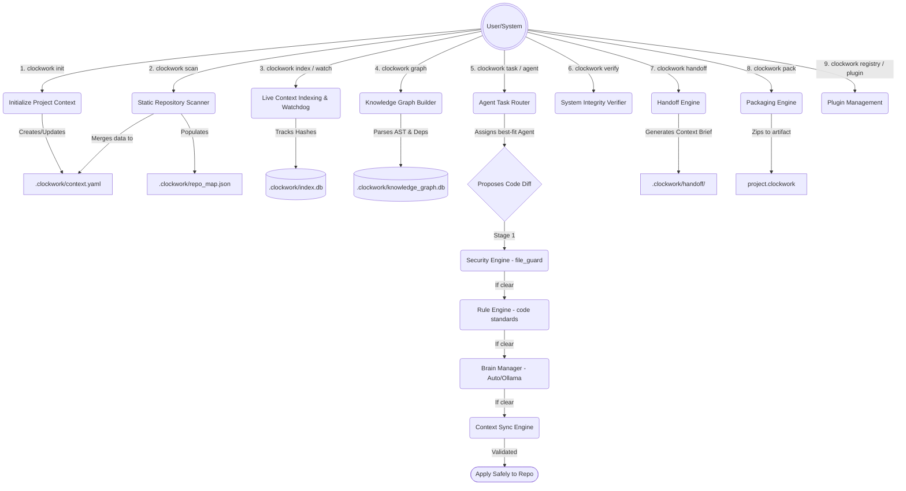

# Clockwork Workflow Pipeline & Command Keys

This document outlines the complete workflow pipeline mapping for the Clockwork repository intelligence system. Below is the operational flowchart detailing the execution order and the corresponding command-line interface (CLI) keys to interact with each subsystem.

## Workflow Flowchart

## CLI Command Keys & Action Mapping

| Phase | CLI Command | Subsystem Orchestrated | Action Description |
| :--- | :--- | :--- | :--- |
| **Setup** | `clockwork init` | Context Engine | Scaffolds `.clockwork/context.yaml` as the source of truth for repository state. |
| **Analysis** | `clockwork scan` | Repository Scanner | Walks the repo tree, identifies languages, counts lines, and generates `repo_map.json`. |
| **Analysis** | `clockwork update` | Context Engine | Manual trigger to merge the latest scan results into the context timeline. |
| **Index** | `clockwork index` | Live Context Index | Builds or incrementally updates the fast-lookup file hash mapping `index.db`. |
| **Index** | `clockwork watch` | Live Context Watchdog| Starts a background daemon that watches file changes and triggers graph/context updates. |
| **Index** | `clockwork repair` | Live Context Index | Wipes and violently rebuilds the entire file index and AST graph from scratch. |
| **Graph** | `clockwork graph` | Graph Engine | Builds the symbolic and dependency properties graph mapping in `knowledge_graph.db`. |
| **Work** | `clockwork agent` | Agent Registry/Runtime| Interacts with registered agents, viewing availability or allocating swarm capabilities. |
| **Work** | `clockwork task` | Task Router | Pushes a task assignment to the autonomous system and triggers the 4-layer Validation Pipeline. |
| **Safeguard**| `clockwork security`| Security Engine | Manually initiates a security scan or audit checking sensitive files or hazardous plugin permissions. |
| **Health** | `clockwork verify` | Verification Engine | Scans the timeline context and structural integrity to check if any undocumented diffs occurred. |
| **Share** | `clockwork handoff` | Handoff Engine | Aggregates all ongoing tasks into `handoff.json` and renders a markdown `next_agent_brief.md`. |
| **Export** | `clockwork pack` | Packaging Engine | Enforces security checks and packages the entire `.clockwork` state into `.clockwork/packages/project.clockwork`. |
| **Import** | `clockwork load` | Packaging Engine | Ingests a `.clockwork` package, verifies valid checksums, and restores it locally. |
| **Extend** | `clockwork registry`| Registry Engine | Interfaces with `registry.clockwork.dev` (or local) to search, update, or remove plugins. |
| **Extend** | `clockwork plugin` | Registry Engine | Publishes a specific plugin artifact into the local or global catalog directory. |

## Explanation of The Auto-Validation Pipeline

When `clockwork task` starts an agent execution block, the system acts as a multi-layer guardrail before any files are applied. This pipeline runs exactly in this progression:

1. **Security Evaluator ([file_guard.py](file:///d:/var-codes/Clockworker/clockwork_project/clockwork-src/clockwork/security/file_guard.py) & [scanner.py](file:///d:/var-codes/Clockworker/clockwork_project/clockwork-src/clockwork/scanner/scanner.py))** -> Is the agent trying to alter `.git` or `.env` files? (*Hard Block*)
2. **Rule Evaluator ([engine.py](file:///d:/var-codes/Clockworker/clockwork_project/clockwork-src/clockwork/rules/engine.py))** -> Does the architecture code diff match formatting directives from `.clockwork/rules.yaml`? (*Hard Block or Warning*)
3. **Brain Evaluator ([brain_manager.py](file:///d:/var-codes/Clockworker/clockwork_project/clockwork-src/clockwork/brain/brain_manager.py))** ->
    - First executes `MiniBrain` (Fast programmatic determinism layer).
    - If valid, cascades to an LLM `OllamaBrain` (Intelligent logical consistency review).
4. **Context Applier ([engine.py](file:///d:/var-codes/Clockworker/clockwork_project/clockwork-src/clockwork/rules/engine.py))** -> Code is placed down, and history log is incremented gracefully.
